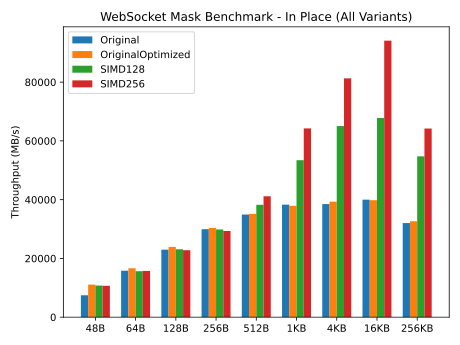
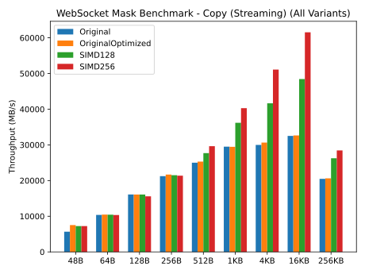

#  WebSocket Mask XOR Benchmark (Go 1.26 SIMD)

This repository benchmarks multiple WebSocket masking (XOR) implementations:

* **Original** - from [`lxzan/gws`](https://github.com/lxzan/gws/blob/main/internal/utils.go#L87)
* **OriginalOptimized** - scalar improvements for small payloads
* **SIMD128** - Go 1.26 `archsimd` (128-bit)
* **SIMD256** - AVX2 (256-bit)

> Built using **Go 1.26** with `//go:build goexperiment.simd` + `GOAMD64=v3` and the new `archsimd` package.

Benchmarks run on:

```
CPU: 13th Gen Intel(R) Core(TM) i9-13900H
goos: linux
goarch: amd64
```

---

## In-Place Benchmark (Hot Buffer)

* Scalar implementations scale predictably but plateau around ~40 GB/s.
* SIMD128 improves throughput starting at mid-size buffers.
* SIMD256 shows strong scaling once loop overhead amortizes.
* ≥4KB clearly demonstrates AVX2’s 32-byte lane advantage.
* 16KB peaks at ~94 GB/s, entering memory-bound territory.
* Large buffers (256KB) reflect cache/memory bandwidth behavior rather than instruction throughput limits.



---

## Copy Benchmark (Streaming / Realistic)

* Original and OriginalOptimized cluster closely.
* SIMD128 improves steadily from 512B upward.
* **SIMD256 now scales correctly across all sizes.**
* ≥4KB shows clear AVX2 advantage.
* 16KB reaches ~61 GB/s.
* 256KB approaches memory-bandwidth limits.



---

## AVX–SSE Transition Fix (Important)

Earlier versions of this benchmark showed a severe performance collapse in the SIMD256 implementation around 512B–1KB in streaming workloads.

This was caused by the classic Intel **AVX ↔ SSE transition penalty**.

When AVX2 (YMM) instructions are executed and then followed by legacy SSE (XMM) instructions without first executing `VZEROUPPER`, the CPU must preserve upper YMM state, which can cause a significant performance penalty.

In streaming benchmarks, each iteration performs:

1. `copy(dst, src)` → `runtime.memmove` (may use SSE)
2. AVX2 mask (YMM instructions)
3. Next iteration repeats

Without clearing the upper YMM state, this mixed workload can tank performance.

The fix:

```go
// perform VZEROUPPER to avoid AVX-SSE transition penalty on next scalar code
// without this the performance can tank drastically on mixed workload.
archsimd.ClearAVXUpperBits()
```

After adding this, SIMD256:

* No longer collapses at 512B–1KB
* Scales consistently
* Matches expected AVX2 throughput
* Reaches ~94 GB/s (in-place) and ~61 GB/s (streaming)

---

## Summary

| Size Range          | Best Implementation              |
| ------------------- | -------------------------------- |
| ≤256B               | OriginalOptimized / SIMD128      |
| 512B–1KB            | SIMD128 or SIMD256 (both stable) |
| ≥4KB                | SIMD256                          |
| Streaming workloads | SIMD256 (with VZEROUPPER fix)    |

---

## Lessons Learned

* AVX2 without `VZEROUPPER` in mixed workloads can catastrophically degrade performance.
* In-place workloads may hide AVX transition penalties.
* Always clear upper YMM state when returning to scalar/SSE code.
* Mid-size buffers (512B–2KB) are where transition costs are most visible.
* Modern CPUs can sustain ~90 GB/s XOR throughput on hot buffers with AVX2.

---


## Test Results (Visualized in the Graphs)

### `var benchMaskFunc = benchMaskInPlace`

```
Running tool: /home/eetu/.gvm/gos/go1.26.0/bin/go test -test.fullpath=true -benchmem -run=^$ -coverprofile=/tmp/vscode-goqvEzaf/go-code-cover -bench . github.com/EetuAH/go-ws-mask-simd-bench

goos: linux
goarch: amd64
pkg: github.com/EetuAH/go-ws-mask-simd-bench
cpu: 13th Gen Intel(R) Core(TM) i9-13900H
BenchmarkMaskOriginal_48B-20               	184248948	         6.446 ns/op	7446.37 MB/s	       0 B/op	       0 allocs/op
BenchmarkMaskOriginal_64B-20               	295244344	         4.050 ns/op	15802.28 MB/s	       0 B/op	       0 allocs/op
BenchmarkMaskOriginal_128B-20              	214563266	         5.571 ns/op	22974.46 MB/s	       0 B/op	       0 allocs/op
BenchmarkMaskOriginal_256B-20              	140081522	         8.549 ns/op	29943.76 MB/s	       0 B/op	       0 allocs/op
BenchmarkMaskOriginal_512B-20              	81848001	        14.65 ns/op	34944.22 MB/s	       0 B/op	       0 allocs/op
BenchmarkMaskOriginal_1KB-20               	44397628	        26.75 ns/op	38282.35 MB/s	       0 B/op	       0 allocs/op
BenchmarkMaskOriginal_4KB-20               	10934634	       106.4 ns/op	38497.47 MB/s	       0 B/op	       0 allocs/op
BenchmarkMaskOriginal_16KB-20              	 2846518	       409.7 ns/op	39994.36 MB/s	       0 B/op	       0 allocs/op
BenchmarkMaskOriginal_256KB-20             	  158694	      8185 ns/op	32026.68 MB/s	       0 B/op	       0 allocs/op
BenchmarkMaskOriginalOptimized_48B-20      	270820047	         4.333 ns/op	11078.37 MB/s	       0 B/op	       0 allocs/op
BenchmarkMaskOriginalOptimized_64B-20      	311831269	         3.845 ns/op	16644.47 MB/s	       0 B/op	       0 allocs/op
BenchmarkMaskOriginalOptimized_128B-20     	224095156	         5.354 ns/op	23906.95 MB/s	       0 B/op	       0 allocs/op
BenchmarkMaskOriginalOptimized_256B-20     	142615688	         8.434 ns/op	30354.82 MB/s	       0 B/op	       0 allocs/op
BenchmarkMaskOriginalOptimized_512B-20     	82801488	        14.56 ns/op	35156.61 MB/s	       0 B/op	       0 allocs/op
BenchmarkMaskOriginalOptimized_1KB-20      	44320815	        27.01 ns/op	37909.47 MB/s	       0 B/op	       0 allocs/op
BenchmarkMaskOriginalOptimized_4KB-20      	11445284	       104.2 ns/op	39317.12 MB/s	       0 B/op	       0 allocs/op
BenchmarkMaskOriginalOptimized_16KB-20     	 2889008	       411.4 ns/op	39822.62 MB/s	       0 B/op	       0 allocs/op
BenchmarkMaskOriginalOptimized_256KB-20    	  137182	      8030 ns/op	32646.34 MB/s	       0 B/op	       0 allocs/op
BenchmarkMaskSIMD128_48B-20                	267587522	         4.459 ns/op	10765.15 MB/s	       0 B/op	       0 allocs/op
BenchmarkMaskSIMD128_64B-20                	295870928	         4.088 ns/op	15655.39 MB/s	       0 B/op	       0 allocs/op
BenchmarkMaskSIMD128_128B-20               	214977421	         5.539 ns/op	23109.68 MB/s	       0 B/op	       0 allocs/op
BenchmarkMaskSIMD128_256B-20               	139877196	         8.578 ns/op	29845.16 MB/s	       0 B/op	       0 allocs/op
BenchmarkMaskSIMD128_512B-20               	89355397	        13.39 ns/op	38238.56 MB/s	       0 B/op	       0 allocs/op
BenchmarkMaskSIMD128_1KB-20                	62646129	        19.17 ns/op	53428.76 MB/s	       0 B/op	       0 allocs/op
BenchmarkMaskSIMD128_4KB-20                	18915643	        62.97 ns/op	65044.30 MB/s	       0 B/op	       0 allocs/op
BenchmarkMaskSIMD128_16KB-20               	 4964374	       241.6 ns/op	67804.39 MB/s	       0 B/op	       0 allocs/op
BenchmarkMaskSIMD128_256KB-20              	  252370	      4788 ns/op	54753.84 MB/s	       0 B/op	       0 allocs/op
BenchmarkMaskSIMD256_48B-20                	266819961	         4.500 ns/op	10666.62 MB/s	       0 B/op	       0 allocs/op
BenchmarkMaskSIMD256_64B-20                	294514598	         4.065 ns/op	15744.33 MB/s	       0 B/op	       0 allocs/op
BenchmarkMaskSIMD256_128B-20               	211454046	         5.617 ns/op	22789.31 MB/s	       0 B/op	       0 allocs/op
BenchmarkMaskSIMD256_256B-20               	137363262	         8.726 ns/op	29336.17 MB/s	       0 B/op	       0 allocs/op
BenchmarkMaskSIMD256_512B-20               	96276760	        12.44 ns/op	41146.40 MB/s	       0 B/op	       0 allocs/op
BenchmarkMaskSIMD256_1KB-20                	75256832	        15.94 ns/op	64254.44 MB/s	       0 B/op	       0 allocs/op
BenchmarkMaskSIMD256_4KB-20                	24800288	        50.39 ns/op	81284.37 MB/s	       0 B/op	       0 allocs/op
BenchmarkMaskSIMD256_16KB-20               	 6880638	       174.1 ns/op	94117.56 MB/s	       0 B/op	       0 allocs/op
BenchmarkMaskSIMD256_256KB-20              	  289249	      4083 ns/op	64196.59 MB/s	       0 B/op	       0 allocs/op
PASS
coverage: 80.8% of statements
ok  	github.com/EetuAH/go-ws-mask-simd-bench	57.301s
```

---


### `var benchMaskFunc = benchMaskCopy`

```
Running tool: /home/eetu/.gvm/gos/go1.26.0/bin/go test -test.fullpath=true -benchmem -run=^$ -coverprofile=/tmp/vscode-goqvEzaf/go-code-cover -bench . github.com/EetuAH/go-ws-mask-simd-bench

goos: linux
goarch: amd64
pkg: github.com/EetuAH/go-ws-mask-simd-bench
cpu: 13th Gen Intel(R) Core(TM) i9-13900H
BenchmarkMaskOriginal_48B-20               	140968834	         8.482 ns/op	5659.33 MB/s	       0 B/op	       0 allocs/op
BenchmarkMaskOriginal_64B-20               	192589972	         6.173 ns/op	10367.92 MB/s	       0 B/op	       0 allocs/op
BenchmarkMaskOriginal_128B-20              	150599972	         7.957 ns/op	16087.31 MB/s	       0 B/op	       0 allocs/op
BenchmarkMaskOriginal_256B-20              	98422863	        12.06 ns/op	21225.93 MB/s	       0 B/op	       0 allocs/op
BenchmarkMaskOriginal_512B-20              	58705677	        20.49 ns/op	24992.98 MB/s	       0 B/op	       0 allocs/op
BenchmarkMaskOriginal_1KB-20               	34696720	        34.72 ns/op	29492.52 MB/s	       0 B/op	       0 allocs/op
BenchmarkMaskOriginal_4KB-20               	 8845221	       136.6 ns/op	29979.79 MB/s	       0 B/op	       0 allocs/op
BenchmarkMaskOriginal_16KB-20              	 2366496	       504.0 ns/op	32507.56 MB/s	       0 B/op	       0 allocs/op
BenchmarkMaskOriginal_256KB-20             	   87442	     12803 ns/op	20475.61 MB/s	       0 B/op	       0 allocs/op
BenchmarkMaskOriginalOptimized_48B-20      	183252936	         6.391 ns/op	7510.50 MB/s	       0 B/op	       0 allocs/op
BenchmarkMaskOriginalOptimized_64B-20      	195031375	         6.125 ns/op	10448.21 MB/s	       0 B/op	       0 allocs/op
BenchmarkMaskOriginalOptimized_128B-20     	150587430	         7.960 ns/op	16080.03 MB/s	       0 B/op	       0 allocs/op
BenchmarkMaskOriginalOptimized_256B-20     	100000000	        11.81 ns/op	21676.87 MB/s	       0 B/op	       0 allocs/op
BenchmarkMaskOriginalOptimized_512B-20     	59363216	        20.23 ns/op	25303.81 MB/s	       0 B/op	       0 allocs/op
BenchmarkMaskOriginalOptimized_1KB-20      	34524410	        34.77 ns/op	29452.42 MB/s	       0 B/op	       0 allocs/op
BenchmarkMaskOriginalOptimized_4KB-20      	 8838620	       133.7 ns/op	30639.26 MB/s	       0 B/op	       0 allocs/op
BenchmarkMaskOriginalOptimized_16KB-20     	 2392056	       501.9 ns/op	32644.79 MB/s	       0 B/op	       0 allocs/op
BenchmarkMaskOriginalOptimized_256KB-20    	   92011	     12708 ns/op	20628.60 MB/s	       0 B/op	       0 allocs/op
BenchmarkMaskSIMD128_48B-20                	181005080	         6.634 ns/op	7235.69 MB/s	       0 B/op	       0 allocs/op
BenchmarkMaskSIMD128_64B-20                	195484628	         6.139 ns/op	10425.11 MB/s	       0 B/op	       0 allocs/op
BenchmarkMaskSIMD128_128B-20               	149819797	         7.960 ns/op	16079.47 MB/s	       0 B/op	       0 allocs/op
BenchmarkMaskSIMD128_256B-20               	99359889	        11.91 ns/op	21492.50 MB/s	       0 B/op	       0 allocs/op
BenchmarkMaskSIMD128_512B-20               	64281535	        18.49 ns/op	27684.89 MB/s	       0 B/op	       0 allocs/op
BenchmarkMaskSIMD128_1KB-20                	40941427	        28.30 ns/op	36183.29 MB/s	       0 B/op	       0 allocs/op
BenchmarkMaskSIMD128_4KB-20                	12012999	        98.33 ns/op	41655.52 MB/s	       0 B/op	       0 allocs/op
BenchmarkMaskSIMD128_16KB-20               	 3447799	       338.1 ns/op	48452.22 MB/s	       0 B/op	       0 allocs/op
BenchmarkMaskSIMD128_256KB-20              	  106615	      9990 ns/op	26241.53 MB/s	       0 B/op	       0 allocs/op
BenchmarkMaskSIMD256_48B-20                	178129677	         6.630 ns/op	7239.65 MB/s	       0 B/op	       0 allocs/op
BenchmarkMaskSIMD256_64B-20                	190738280	         6.194 ns/op	10333.20 MB/s	       0 B/op	       0 allocs/op
BenchmarkMaskSIMD256_128B-20               	145912436	         8.221 ns/op	15570.45 MB/s	       0 B/op	       0 allocs/op
BenchmarkMaskSIMD256_256B-20               	100000000	        11.99 ns/op	21357.03 MB/s	       0 B/op	       0 allocs/op
BenchmarkMaskSIMD256_512B-20               	69066751	        17.28 ns/op	29631.00 MB/s	       0 B/op	       0 allocs/op
BenchmarkMaskSIMD256_1KB-20                	46445061	        25.42 ns/op	40285.79 MB/s	       0 B/op	       0 allocs/op
BenchmarkMaskSIMD256_4KB-20                	14873251	        80.16 ns/op	51095.54 MB/s	       0 B/op	       0 allocs/op
BenchmarkMaskSIMD256_16KB-20               	 4502089	       266.2 ns/op	61551.58 MB/s	       0 B/op	       0 allocs/op
BenchmarkMaskSIMD256_256KB-20              	  128241	      9218 ns/op	28438.96 MB/s	       0 B/op	       0 allocs/op
PASS
coverage: 80.8% of statements
ok  	github.com/EetuAH/go-ws-mask-simd-bench	55.544s
```
