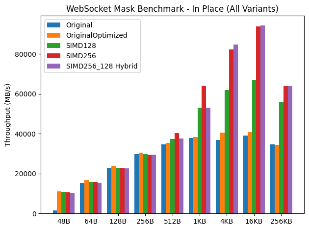
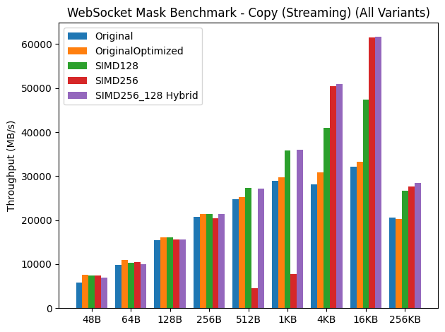

#  WebSocket Mask XOR Benchmark (Go 1.26 SIMD)

This repository benchmarks multiple WebSocket masking (XOR) implementations:

* **Original** - from [`lxzan/gws`](https://github.com/lxzan/gws/blob/main/internal/utils.go#L87)
* **OriginalOptimized** - small scalar improvements
* **SIMD128** - Go 1.26 `archsimd` (128-bit)
* **SIMD256** - AVX2 (256-bit)
* **SIMD256_128 (Hybrid)** - AVX2 for large buffers, SIMD128 fallback for mid-size buffers

> Built using **Go 1.26** with `//go:build goexperiment.simd` and the new `archsimd` package.

Benchmarks run on:

```
CPU: 13th Gen Intel(R) Core(TM) i9-13900H
goos: linux
goarch: amd64
```

---

## In-Place Benchmark (Hot Buffer)

* Original is slower at smaller payloads <64B.
* OriginalOptimized quickly catches up.
* SIMD128 starts pulling ahead at 512B+.
* SIMD256 dominates strongly from 1KB upward.
* Hybrid matches or slightly beats pure SIMD256 at larger sizes.
* 16KB peak shows ~94 GB/s ceiling territory.




---

## Copy Benchmark (Streaming / Realistic)

* Original and OriginalOptimized cluster closely.
* SIMD128 improves steadily.
* **Pure SIMD256 collapses at 512B / 1KB (AVX downclock zone).**
* Hybrid completely fixes that dip.
* ≥4KB shows clear SIMD256 advantage.
* 256KB shows memory-bandwidth limit across all variants.



---

# 🧠 Why SIMD256 Collapses at 512B–1KB?

On many Intel CPUs (including 13th gen):

* Heavy AVX2 usage can trigger **frequency downclocking**
* For small workloads, AVX startup cost > benefit
* In streaming scenarios, memory pressure amplifies this

The **Hybrid approach** avoids this by:

* Using AVX2 only for large buffers
* Falling back to 128-bit SIMD for mid-sized buffers

This gives the best overall performance profile.

---

# 🏁 Summary

| Size Range          | Best Implementation         |
| ------------------- | --------------------------- |
| ≤256B               | OriginalOptimized / SIMD128 |
| 512B–1KB            | SIMD128                     |
| ≥4KB                | SIMD256 or Hybrid           |
| Streaming workloads | Hybrid                      |


---

## Test Results (Visualized in the Graphs)

### `var benchMaskFunc = benchMaskInPlace`

```
Running tool: /home/eetu/.gvm/gos/go1.26.0/bin/go test -test.fullpath=true -benchmem -run=^$ -coverprofile=/tmp/vscode-gogVnK9U/go-code-cover -bench . github.com/EetuAH/go-ws-mask-simd-bench

goos: linux
goarch: amd64
pkg: github.com/EetuAH/go-ws-mask-simd-bench
cpu: 13th Gen Intel(R) Core(TM) i9-13900H
BenchmarkMaskOriginal_48B-20               	189498069	         6.163 ns/op	7788.35 MB/s	       0 B/op	       0 allocs/op
BenchmarkMaskOriginal_64B-20               	278687907	         4.195 ns/op	15256.09 MB/s	       0 B/op	       0 allocs/op
BenchmarkMaskOriginal_128B-20              	213519146	         5.675 ns/op	22556.11 MB/s	       0 B/op	       0 allocs/op
BenchmarkMaskOriginal_256B-20              	139013493	         8.622 ns/op	29691.48 MB/s	       0 B/op	       0 allocs/op
BenchmarkMaskOriginal_512B-20              	81275397	        14.77 ns/op	34675.26 MB/s	       0 B/op	       0 allocs/op
BenchmarkMaskOriginal_1KB-20               	44272674	        27.05 ns/op	37862.77 MB/s	       0 B/op	       0 allocs/op
BenchmarkMaskOriginal_4KB-20               	10721649	       111.2 ns/op	36819.80 MB/s	       0 B/op	       0 allocs/op
BenchmarkMaskOriginal_16KB-20              	 2862544	       419.0 ns/op	39098.89 MB/s	       0 B/op	       0 allocs/op
BenchmarkMaskOriginal_256KB-20             	  134149	      7666 ns/op	34194.32 MB/s	       0 B/op	       0 allocs/op
BenchmarkMaskOriginalOptimized_48B-20      	277208416	         4.331 ns/op	11082.88 MB/s	       0 B/op	       0 allocs/op
BenchmarkMaskOriginalOptimized_64B-20      	312682412	         3.843 ns/op	16654.87 MB/s	       0 B/op	       0 allocs/op
BenchmarkMaskOriginalOptimized_128B-20     	224248484	         5.384 ns/op	23774.27 MB/s	       0 B/op	       0 allocs/op
BenchmarkMaskOriginalOptimized_256B-20     	142600744	         8.382 ns/op	30540.02 MB/s	       0 B/op	       0 allocs/op
BenchmarkMaskOriginalOptimized_512B-20     	82580326	        14.51 ns/op	35296.55 MB/s	       0 B/op	       0 allocs/op
BenchmarkMaskOriginalOptimized_1KB-20      	44998446	        26.70 ns/op	38355.50 MB/s	       0 B/op	       0 allocs/op
BenchmarkMaskOriginalOptimized_4KB-20      	11156001	        99.91 ns/op	40998.29 MB/s	       0 B/op	       0 allocs/op
BenchmarkMaskOriginalOptimized_16KB-20     	 2984728	       401.5 ns/op	40807.46 MB/s	       0 B/op	       0 allocs/op
BenchmarkMaskOriginalOptimized_256KB-20    	  141429	      7612 ns/op	34438.03 MB/s	       0 B/op	       0 allocs/op
BenchmarkMaskSIMD128_48B-20                	269355254	         4.456 ns/op	10770.98 MB/s	       0 B/op	       0 allocs/op
BenchmarkMaskSIMD128_64B-20                	292645604	         4.026 ns/op	15896.69 MB/s	       0 B/op	       0 allocs/op
BenchmarkMaskSIMD128_128B-20               	216689595	         5.532 ns/op	23137.05 MB/s	       0 B/op	       0 allocs/op
BenchmarkMaskSIMD128_256B-20               	138223059	         8.584 ns/op	29822.55 MB/s	       0 B/op	       0 allocs/op
BenchmarkMaskSIMD128_512B-20               	87885271	        13.70 ns/op	37379.96 MB/s	       0 B/op	       0 allocs/op
BenchmarkMaskSIMD128_1KB-20                	56561389	        19.34 ns/op	52945.92 MB/s	       0 B/op	       0 allocs/op
BenchmarkMaskSIMD128_4KB-20                	15687424	        66.24 ns/op	61838.28 MB/s	       0 B/op	       0 allocs/op
BenchmarkMaskSIMD128_16KB-20               	 4899441	       246.2 ns/op	66546.62 MB/s	       0 B/op	       0 allocs/op
BenchmarkMaskSIMD128_256KB-20              	  231084	      4657 ns/op	56292.66 MB/s	       0 B/op	       0 allocs/op
BenchmarkMaskSIMD256_48B-20                	266935621	         4.497 ns/op	10674.83 MB/s	       0 B/op	       0 allocs/op
BenchmarkMaskSIMD256_64B-20                	295264654	         4.057 ns/op	15776.11 MB/s	       0 B/op	       0 allocs/op
BenchmarkMaskSIMD256_128B-20               	211219422	         5.627 ns/op	22747.64 MB/s	       0 B/op	       0 allocs/op
BenchmarkMaskSIMD256_256B-20               	137328777	         8.725 ns/op	29339.96 MB/s	       0 B/op	       0 allocs/op
BenchmarkMaskSIMD256_512B-20               	95643570	        12.63 ns/op	40526.18 MB/s	       0 B/op	       0 allocs/op
BenchmarkMaskSIMD256_1KB-20                	74856728	        16.07 ns/op	63720.53 MB/s	       0 B/op	       0 allocs/op
BenchmarkMaskSIMD256_4KB-20                	24874134	        48.29 ns/op	84825.44 MB/s	       0 B/op	       0 allocs/op
BenchmarkMaskSIMD256_16KB-20               	 6802706	       175.8 ns/op	93194.92 MB/s	       0 B/op	       0 allocs/op
BenchmarkMaskSIMD256_256KB-20              	  293384	      4089 ns/op	64102.10 MB/s	       0 B/op	       0 allocs/op
BenchmarkMaskSIMD256_128_48B-20            	260352027	         4.596 ns/op	10443.81 MB/s	       0 B/op	       0 allocs/op
BenchmarkMaskSIMD256_128_64B-20            	288736432	         4.149 ns/op	15424.66 MB/s	       0 B/op	       0 allocs/op
BenchmarkMaskSIMD256_128_128B-20           	208576470	         5.650 ns/op	22653.63 MB/s	       0 B/op	       0 allocs/op
BenchmarkMaskSIMD256_128_256B-20           	138048318	         8.680 ns/op	29493.19 MB/s	       0 B/op	       0 allocs/op
BenchmarkMaskSIMD256_128_512B-20           	88274712	        13.66 ns/op	37473.70 MB/s	       0 B/op	       0 allocs/op
BenchmarkMaskSIMD256_128_1KB-20            	61826983	        19.31 ns/op	53029.30 MB/s	       0 B/op	       0 allocs/op
BenchmarkMaskSIMD256_128_4KB-20            	24635410	        48.93 ns/op	83718.64 MB/s	       0 B/op	       0 allocs/op
BenchmarkMaskSIMD256_128_16KB-20           	 6892786	       174.7 ns/op	93797.06 MB/s	       0 B/op	       0 allocs/op
BenchmarkMaskSIMD256_128_256KB-20          	  292480	      4094 ns/op	64035.09 MB/s	       0 B/op	       0 allocs/op
PASS
coverage: 82.0% of statements
ok  	github.com/EetuAH/go-ws-mask-simd-bench	69.070s
```

---


### `var benchMaskFunc = benchMaskCopy`

```
Running tool: /home/eetu/.gvm/gos/go1.26.0/bin/go test -test.fullpath=true -benchmem -run=^$ -coverprofile=/tmp/vscode-gogVnK9U/go-code-cover -bench . github.com/EetuAH/go-ws-mask-simd-bench

goos: linux
goarch: amd64
pkg: github.com/EetuAH/go-ws-mask-simd-bench
cpu: 13th Gen Intel(R) Core(TM) i9-13900H
BenchmarkMaskOriginal_48B-20               	144569544	         8.189 ns/op	5861.74 MB/s	       0 B/op	       0 allocs/op
BenchmarkMaskOriginal_64B-20               	188478589	         6.510 ns/op	9831.46 MB/s	       0 B/op	       0 allocs/op
BenchmarkMaskOriginal_128B-20              	147061336	         8.283 ns/op	15453.34 MB/s	       0 B/op	       0 allocs/op
BenchmarkMaskOriginal_256B-20              	97593014	        12.34 ns/op	20753.63 MB/s	       0 B/op	       0 allocs/op
BenchmarkMaskOriginal_512B-20              	58636292	        20.62 ns/op	24827.64 MB/s	       0 B/op	       0 allocs/op
BenchmarkMaskOriginal_1KB-20               	34130131	        35.34 ns/op	28975.90 MB/s	       0 B/op	       0 allocs/op
BenchmarkMaskOriginal_4KB-20               	 7881733	       145.6 ns/op	28122.23 MB/s	       0 B/op	       0 allocs/op
BenchmarkMaskOriginal_16KB-20              	 2325588	       509.4 ns/op	32166.23 MB/s	       0 B/op	       0 allocs/op
BenchmarkMaskOriginal_256KB-20             	   94708	     12702 ns/op	20637.66 MB/s	       0 B/op	       0 allocs/op
BenchmarkMaskOriginalOptimized_48B-20      	188014878	         6.379 ns/op	7524.41 MB/s	       0 B/op	       0 allocs/op
BenchmarkMaskOriginalOptimized_64B-20      	204027714	         5.865 ns/op	10913.07 MB/s	       0 B/op	       0 allocs/op
BenchmarkMaskOriginalOptimized_128B-20     	150967063	         7.949 ns/op	16101.96 MB/s	       0 B/op	       0 allocs/op
BenchmarkMaskOriginalOptimized_256B-20     	97705269	        11.97 ns/op	21395.14 MB/s	       0 B/op	       0 allocs/op
BenchmarkMaskOriginalOptimized_512B-20     	59614141	        20.29 ns/op	25237.15 MB/s	       0 B/op	       0 allocs/op
BenchmarkMaskOriginalOptimized_1KB-20      	34885088	        34.38 ns/op	29781.43 MB/s	       0 B/op	       0 allocs/op
BenchmarkMaskOriginalOptimized_4KB-20      	 8981322	       133.1 ns/op	30780.93 MB/s	       0 B/op	       0 allocs/op
BenchmarkMaskOriginalOptimized_16KB-20     	 2397496	       491.4 ns/op	33344.54 MB/s	       0 B/op	       0 allocs/op
BenchmarkMaskOriginalOptimized_256KB-20    	   83149	     12906 ns/op	20312.27 MB/s	       0 B/op	       0 allocs/op
BenchmarkMaskSIMD128_48B-20                	186021304	         6.429 ns/op	7466.65 MB/s	       0 B/op	       0 allocs/op
BenchmarkMaskSIMD128_64B-20                	193218806	         6.169 ns/op	10375.06 MB/s	       0 B/op	       0 allocs/op
BenchmarkMaskSIMD128_128B-20               	150383638	         7.982 ns/op	16035.97 MB/s	       0 B/op	       0 allocs/op
BenchmarkMaskSIMD128_256B-20               	96895195	        11.94 ns/op	21436.30 MB/s	       0 B/op	       0 allocs/op
BenchmarkMaskSIMD128_512B-20               	62828049	        18.72 ns/op	27348.15 MB/s	       0 B/op	       0 allocs/op
BenchmarkMaskSIMD128_1KB-20                	38543594	        28.57 ns/op	35846.82 MB/s	       0 B/op	       0 allocs/op
BenchmarkMaskSIMD128_4KB-20                	12044654	        99.97 ns/op	40972.58 MB/s	       0 B/op	       0 allocs/op
BenchmarkMaskSIMD128_16KB-20               	 3469204	       345.5 ns/op	47416.37 MB/s	       0 B/op	       0 allocs/op
BenchmarkMaskSIMD128_256KB-20              	  117438	      9822 ns/op	26688.67 MB/s	       0 B/op	       0 allocs/op
BenchmarkMaskSIMD256_48B-20                	183513603	         6.416 ns/op	7480.89 MB/s	       0 B/op	       0 allocs/op
BenchmarkMaskSIMD256_64B-20                	195501397	         6.118 ns/op	10461.11 MB/s	       0 B/op	       0 allocs/op
BenchmarkMaskSIMD256_128B-20               	145997406	         8.208 ns/op	15594.70 MB/s	       0 B/op	       0 allocs/op
BenchmarkMaskSIMD256_256B-20               	83312516	        12.51 ns/op	20469.68 MB/s	       0 B/op	       0 allocs/op
BenchmarkMaskSIMD256_512B-20               	 9418728	       114.4 ns/op	4476.28 MB/s	       0 B/op	       0 allocs/op
BenchmarkMaskSIMD256_1KB-20                	 9004363	       131.7 ns/op	7776.99 MB/s	       0 B/op	       0 allocs/op
BenchmarkMaskSIMD256_4KB-20                	12990074	        81.10 ns/op	50502.58 MB/s	       0 B/op	       0 allocs/op
BenchmarkMaskSIMD256_16KB-20               	 4513280	       266.2 ns/op	61554.72 MB/s	       0 B/op	       0 allocs/op
BenchmarkMaskSIMD256_256KB-20              	  110976	      9464 ns/op	27698.90 MB/s	       0 B/op	       0 allocs/op
BenchmarkMaskSIMD256_128_48B-20            	176435290	         6.924 ns/op	6932.44 MB/s	       0 B/op	       0 allocs/op
BenchmarkMaskSIMD256_128_64B-20            	192183895	         6.354 ns/op	10072.29 MB/s	       0 B/op	       0 allocs/op
BenchmarkMaskSIMD256_128_128B-20           	145739970	         8.228 ns/op	15556.22 MB/s	       0 B/op	       0 allocs/op
BenchmarkMaskSIMD256_128_256B-20           	100000000	        11.93 ns/op	21455.12 MB/s	       0 B/op	       0 allocs/op
BenchmarkMaskSIMD256_128_512B-20           	60542701	        18.80 ns/op	27238.19 MB/s	       0 B/op	       0 allocs/op
BenchmarkMaskSIMD256_128_1KB-20            	41977092	        28.44 ns/op	36002.27 MB/s	       0 B/op	       0 allocs/op
BenchmarkMaskSIMD256_128_4KB-20            	13992894	        80.33 ns/op	50989.88 MB/s	       0 B/op	       0 allocs/op
BenchmarkMaskSIMD256_128_16KB-20           	 4526767	       265.4 ns/op	61741.16 MB/s	       0 B/op	       0 allocs/op
BenchmarkMaskSIMD256_128_256KB-20          	  129128	      9226 ns/op	28414.78 MB/s	       0 B/op	       0 allocs/op
PASS
coverage: 82.0% of statements
ok  	github.com/EetuAH/go-ws-mask-simd-bench	67.038s
```
